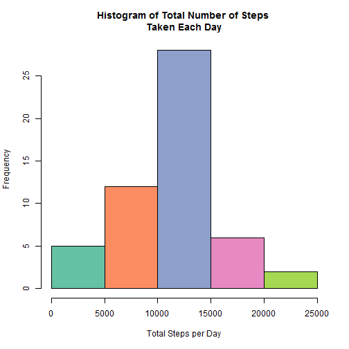
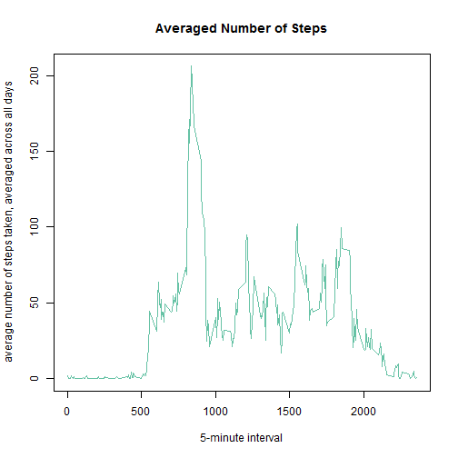
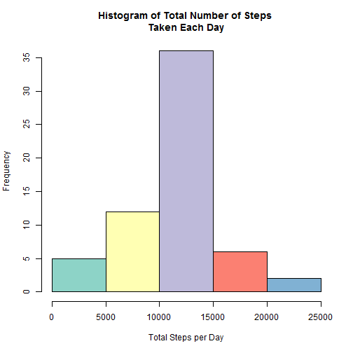

### Loading and preprocessing the data

1. Load the data (i.e. `read.csv()`)

Download data from the Web


```r
fileUrl<- "http://d396qusza40orc.cloudfront.net/repdata%2Fdata%2Factivity.zip"
download.file(fileUrl, destfile="./data.zip", mode="wb")
```

Unzip the data


```r
unzip("data.zip")
list.files()
```

```
## [1] "activity.csv"            "data.zip"               
## [3] "PA1_template.Rmd"        "RepData_PeerAssessment1"
## [5] "trial1.R"                "trial2.R"
```

Read the data and look at its structure.


```r
activity<- read.csv("activity.csv")
head(activity)
```

```
##   steps       date interval
## 1    NA 2012-10-01        0
## 2    NA 2012-10-01        5
## 3    NA 2012-10-01       10
## 4    NA 2012-10-01       15
## 5    NA 2012-10-01       20
## 6    NA 2012-10-01       25
```

```r
str(activity)
```

```
## 'data.frame':	17568 obs. of  3 variables:
##  $ steps   : int  NA NA NA NA NA NA NA NA NA NA ...
##  $ date    : Factor w/ 61 levels "2012-10-01","2012-10-02",..: 1 1 1 1 1 1 1 1 1 1 ...
##  $ interval: int  0 5 10 15 20 25 30 35 40 45 ...
```


2. Process/transform the data (if necessary) into a format suitable for the analysis

Convert activity$date to Date format 


```r
activity$date<- as.Date(activity$date)
```
  
  
### What is mean total number of steps taken per day?

1. Calculate the total number of steps taken per day


```r
stepsPerDay<- aggregate(steps~date, activity, sum)
head(stepsPerDay)
```

```
##         date steps
## 1 2012-10-02   126
## 2 2012-10-03 11352
## 3 2012-10-04 12116
## 4 2012-10-05 13294
## 5 2012-10-06 15420
## 6 2012-10-07 11015
```

2. Make a histogram of the total number of steps taken each day


```r
library("RColorBrewer")
hist(stepsPerDay$steps, 
     col=brewer.pal(7, "Set2"),
     main="Histogram of Total Number of Steps 
Taken Each Day",
     xlab="Total Steps per Day")
```

 

3. Calculate and report the mean and median of the total number of steps taken per day


```r
average<- mean(stepsPerDay$steps)
average
```

```
## [1] 10766.19
```

```r
median<- median(stepsPerDay$steps)
median
```

```
## [1] 10765
```

The mean of the total number of steps is 1.0766189 &times; 10<sup>4</sup>, the median is 10765. Based on
this we can say that the distribution has a very slight positive skew. 


### What is the average daily activity pattern?

1. Make a time series plot (i.e. `type = "l"`) of the 5-minute interval (x-axis) and the average number of steps taken, averaged across all days (y-axis)


```r
library("RColorBrewer")

interval.steps<- aggregate(steps~interval, activity, mean)

plot(interval.steps,
     type="l",
     main="Averaged Number of Steps",
     xlab="5-minute interval",
     ylab="average number of steps taken, averaged across all days",
     col=brewer.pal(7, "Set2"))
```

 

2. Which 5-minute interval, on average across all the days in the dataset, contains the maximum number of steps?


```r
max.steps.interval<- which.max(interval.steps$steps)
interval.steps[max.steps.interval,]
```

```
##     interval    steps
## 104      835 206.1698
```

```r
stepmax=round(interval.steps[max.steps.interval,2], digits=0)
```

Interval 835 contains the maximum average number of steps, which is 206. 

### Imputing missing values

1. Calculate and report the total number of missing values in the dataset (i.e. the total number of rows with `NA`s)


```r
sum(!complete.cases(activity))
```

```
## [1] 2304
```

There are 2304 rows with missing values.

2. Devise a strategy for filling in all of the missing values in the dataset. 

I think that the best strategy will be to use the mean number of steps for each time interval (as time interval should have a higher effect on the number of steps.)

3. Create a new dataset that is equal to the original dataset but with the missing data filled in.


```r
activity2<- activity
for (i in 1:nrow(activity2)){
  if (is.na(activity2$steps[i])){
    interval.value <- activity2$interval[i]
    row.id <- which(interval.steps$interval == interval.value)
    steps.value <- interval.steps$steps[row.id]
    activity2$steps[i] <- steps.value
  }
}
```

4. Make a histogram of the total number of steps taken each day

```r
library(RColorBrewer)
stepsPerDay2<- aggregate(steps~date, activity2, sum)

hist(stepsPerDay2$steps, 
     col=brewer.pal(7, "Set3"),
     main="Histogram of Total Number of Steps 
Taken Each Day",
     xlab="Total Steps per Day")
```

 

Calculate and report the **mean** and **median** total number of steps taken per day.


```r
average2<- mean(stepsPerDay2$steps)
average2
```

```
## [1] 10766.19
```

```r
median2<- median(stepsPerDay2$steps)
median2
```

```
## [1] 10766.19
```

Now we can see that mean (1.0766189 &times; 10<sup>4</sup>) and median (1.0766189 &times; 10<sup>4</sup>) have equal values.The average value hasn't changed, while median has increased.  Therefore, after the missing data was filled in, the distribution became not skewed. 


### Are there differences in activity patterns between weekdays and weekends?

1. Create a new factor variable in the dataset with two levels -- "weekday" and "weekend" indicating whether a given date is a weekday or weekend day.


```r
activity2$day.type<- c("Weekday")

for (i in 1:nrow(activity2)) 
  if (weekdays(activity2$date[i]) %in% c("Sunday","Saturday"))
    activity2$day.type[i]<- "Weekend"
```

2. Make a panel plot containing a time series plot (i.e. `type = "l"`) of the 5-minute interval (x-axis) and the average number of steps taken, averaged across all weekday days or weekend days (y-axis). 


```r
library("ggplot2")
weekday.interval.steps<- aggregate(steps~interval + day.type, activity2, mean)

qplot(interval, steps, data=weekday.interval.steps, geom="line", col=day.type,
      xlab= "5-minute interval",
      ylab="average number of steps taken, averaged across all days") + 
  facet_wrap(~day.type, ncol=1) 
```

 

As we can see, there are differences between weekend and weekday performance. 
